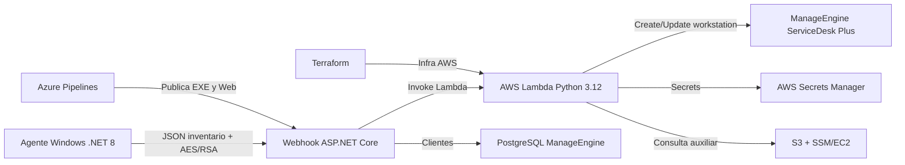

# AutoInventario

AutoInventario es una suite para recopilar inventario de equipos Windows, cifrar el payload localmente y sincronizarlo con ManageEngine ServiceDesk Plus a traves de un Webhook ASP.NET Core y una Lambda en AWS.

## Estado actual

La estructura canonica del agente es la raiz del repositorio. `AutoInventario.csproj`, `Program.cs`, `Helpers/`, `Models/`, `Services/` y `Resources/` pertenecen al agente Windows.

La solucion, los tests y el pipeline principal apuntan al proyecto raiz `AutoInventario.csproj`.

Resumen de validaciones principales:

| Validacion | Resultado |
| --- | --- |
| `dotnet build AutoInventario.sln -c Debug` | Compila; pueden quedar warnings nullable del agente. |
| `dotnet build AutoInventario.csproj -c Debug` | Compila con un warning nullable en `Helpers/UserSystemHelper.cs`. |
| `dotnet build AutoInventario.Updater/AutoInventario.Updater.csproj -c Debug` | Correcto. |
| `dotnet build Webhook/Webhook-Inventario.csproj -c Debug` | Correcto en `net8.0`, sin warnings. |
| `dotnet test AutoInventario.Tests/AutoInventario.Tests.csproj -c Debug` | Correcto; referencia el proyecto raiz del agente. |
| `python -m py_compile Lambda-Inventario/lambda_function.py` | Correcto. |
| `terraform fmt -check -recursive` | Falla formato en `Infraestructura-Terraform/main.tf`. |
| `terraform validate -no-color` | Falla porque falta inicializar el provider AWS con `terraform init`. |
| `dotnet list package --vulnerable --include-transitive` | Webhook sin vulnerabilidades reportadas; revisar agente por separado. |

Las auditorias historicas estan en [docs/AUDIT.md](docs/AUDIT.md) y [docs/AUDIT-CURRENT.md](docs/AUDIT-CURRENT.md).

## Arquitectura



Componentes principales:

- Agente Windows: ejecutable .NET 8 que recopila datos por WMI, registro y APIs de Windows, cifra el inventario y lo envia al Webhook.
- Updater: ejecutable .NET 8 que reemplaza el agente instalado y relanza la tarea programada.
- Webhook: API ASP.NET Core que recibe eventos cifrados, expone clientes y manifiesto de actualizaciones.
- Lambda: funcion Python que descifra, normaliza y crea/actualiza workstations en ManageEngine.
- Terraform: definicion base de rol IAM, Secrets Manager y Lambda.
- Azure Pipelines: gates de producto, escaneo de secretos, escaneo NuGet, publish, firma de ejecutables y empaquetado del sitio Webhook.

## Estructura del repositorio

| Ruta | Proposito |
| --- | --- |
| `AutoInventario.csproj` | Proyecto canonico del agente en la raiz. |
| `Program.cs`, `Helpers/`, `Models/`, `Services/`, `Resources/` | Codigo y recursos del agente Windows. |
| `AutoInventario.Updater/` | Updater independiente del agente. |
| `AutoInventario.Tests/` | Proyecto xUnit. Hoy contiene una prueba placeholder. |
| `Webhook.Tests/` | Tests de seguridad y middleware del Webhook. |
| `Webhook/` | API ASP.NET Core, pagina de estado, endpoints de clientes y actualizaciones. |
| `Lambda-Inventario/` | Lambda Python, requirements y script de empaquetado/despliegue. |
| `Infraestructura-Terraform/` | Infraestructura AWS declarativa. |
| `.azure-pipelines/pipeline.yml` | Pipeline Terraform. |
| `azure-pipelines.yml` | Pipeline principal de calidad, build, firma y artefactos. |
| `docs/` | Auditoria, arquitectura y operacion. |
| `AGENTS.MD` | Plantilla de instrucciones para agentes de IA/coding assistants. |

## Requisitos

- Windows para ejecutar y validar completamente el agente.
- .NET SDK 8 para agente, updater y tests.
- .NET SDK/runtime 8 para el Webhook.
- Python 3.12 para Lambda.
- Terraform >= 1.5 para infraestructura.
- AWS CLI configurado para despliegues Lambda/Terraform.
- Credenciales y secretos gestionados fuera del repositorio.

## Configuracion

No guardes secretos reales en el repositorio. Cualquier valor que ya haya sido versionado debe considerarse comprometido y rotarse.

Webhook:

- `ConnectionStrings:Postgres`: conexion de lectura a PostgreSQL/ManageEngine.
- `AutoInventario:ApiKey`: clave esperada por `X-AutoInventario-Key` para rutas protegidas.
- `Security:PrivateKeyPath`: ruta local de la clave privada. Preferible por variable `WEBHOOK_PRIVATE_KEY_PATH`.
- `AWS_REGION`: region usada por el AWS SDK.
- `AUTOINVENTARIO_LAMBDA_NAME`: nombre de la Lambda a invocar.
- Credenciales AWS: usar IAM Role, variables de entorno o provider chain de AWS SDK; no claves en codigo.

Lambda:

- `manageengine_api_key`: token de ManageEngine en AWS Secrets Manager.
- `autoinventario/private_key`: clave privada en AWS Secrets Manager.
- Ajustar regiones y permisos IAM para Secrets Manager, S3 y SSM segun el entorno real.

Agente:

- `-client_id <id>`: cliente/organizacion ManageEngine.
- `-url <base_url>`: URL base del Webhook. El endpoint final es `/webhooks`.
- `-del`: desinstala el agente y elimina la tarea programada.
- `AUTOINVENTARIO_WEBHOOK_API_KEY`: API key enviada por el agente al Webhook cuando el endpoint la requiera.

## Compilacion y pruebas

Estado actual recomendado para diagnostico:

```powershell
dotnet build AutoInventario.sln -c Debug
dotnet build AutoInventario.csproj -c Debug
dotnet build AutoInventario.Updater\AutoInventario.Updater.csproj -c Debug
dotnet build Webhook\Webhook-Inventario.csproj -c Debug
dotnet test AutoInventario.Tests\AutoInventario.Tests.csproj -c Debug
dotnet test Webhook.Tests\Webhook.Tests.csproj -c Debug
python -m py_compile Lambda-Inventario\lambda_function.py
terraform -chdir=Infraestructura-Terraform fmt -check -recursive
terraform -chdir=Infraestructura-Terraform validate -no-color
```

Pendientes conocidos:

- Tests reales para cifrado, serializacion, updater, endpoints y Lambda.
- Warnings nullable restantes en el agente.

## Despliegue

Pipeline principal:

1. Ejecuta gates de secretos, vulnerabilidades NuGet, builds, tests, Python compile y Terraform fmt.
2. Publica agente, updater y Webhook.
3. Firma los ejecutables con PFX de Azure DevOps Secure Files.
4. Copia artefactos de actualizacion a `wwwroot/updates`.
5. Genera `latest.json` y archivos SHA256.

Detalle: `docs/CI-CD.md`.

Lambda:

```bash
cd Lambda-Inventario
bash deploy_lambda.sh
```

Terraform:

```bash
cd Infraestructura-Terraform
terraform init
terraform fmt -recursive
terraform plan
terraform apply
```

Revisar [docs/OPERATIONS.md](docs/OPERATIONS.md) antes de desplegar.

## Seguridad

El proyecto maneja datos sensibles: identificadores de hardware, usuarios locales, IPs, licencias y contrasenas de recuperacion BitLocker. La operacion debe tener base legal, retencion definida y controles de acceso.

Hallazgos criticos de la auditoria:

- Hay secretos, tokens, claves privadas y credenciales AWS en archivos del repo/arbol local.
- El POST `/webhooks` no valida actualmente la API key en el controlador.
- Hay logging de claves o datos sensibles en varios flujos.
- El cifrado usa confidencialidad, pero no autenticidad del payload; conviene migrar a AEAD o agregar firma/HMAC.
- Dependencias y frameworks tienen avisos de soporte/vulnerabilidad.

Consulta [docs/AUDIT.md](docs/AUDIT.md) para prioridades y remediacion.
