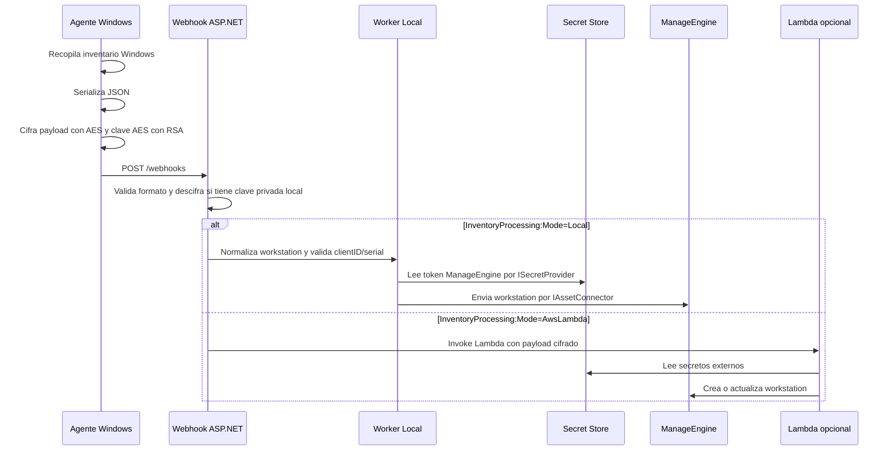

# Arquitectura

## Objetivo

AutoInventario automatiza la recogida de inventario de equipos Windows y mantiene workstations en ManageEngine ServiceDesk Plus. El diseno separa captura local, recepcion web, procesamiento de inventario, conectores de activos e infraestructura opcional AWS.

## Flujo principal



## Agente Windows

Responsabilidades:

- Mostrar formulario de configuracion cuando se ejecuta sin argumentos.
- Instalarse en `C:\ProgramData\AutoInventario`.
- Registrar entrada de desinstalacion en Windows.
- Crear tarea programada `AutoInventario`.
- Recopilar inventario mediante WMI, registro y APIs del sistema.
- Cifrar payload antes de enviarlo.
- Consultar manifiesto de actualizacion y delegar reemplazo al Updater.

Entradas:

- `-client_id <id>` para asociar el inventario a una cuenta ManageEngine.
- `-url <base_url>` para apuntar a otro Webhook.
- `-del` para desinstalar.

Salida:

```json
{
  "clientID": "1",
  "data": "<base64>",
  "key": "<base64>",
  "iv": "<base64>"
}
```

## Updater

Responsabilidades:

- Esperar o cerrar el proceso del agente.
- Copiar el ejecutable nuevo sobre el destino instalado.
- Leer argumentos de la tarea programada.
- Relanzar el agente actualizado.
- Registrar log en `C:\ProgramData\AutoInventario\logs.txt`.

El Webhook publica `latest.json` con version, URLs y hashes SHA256. El agente descarga agente y updater, valida SHA256 y ejecuta el updater.

## Webhook

Responsabilidades:

- Recibir `POST /webhooks`.
- Exponer `GET /id-clients` para clientes disponibles.
- Exponer `GET /updates/latest.json` y binarios bajo `wwwroot/updates`.
- Aplicar cabeceras de seguridad.
- Procesar inventario con `IInventoryProcessor`.
- Ejecutar worker local con `IInventoryNormalizer`, `IAssetConnector` e `ISecretProvider`.
- Invocar Lambda con el evento cifrado solo cuando `InventoryProcessing:Mode=AwsLambda`.
- Validar licencias offline con `ILicenseValidator` para ediciones comerciales.
- Mantener un store en memoria para ultimos eventos.

Modo local:

- `InventoryNormalizationService` replica las reglas minimas de la Lambda para limpiar nulos, puertos invalidos, discos y placeholders de BIOS/OEM.
- `ManageEngineConnector` envia el payload normalizado al endpoint configurado de workstations.
- `ConfigurationSecretProvider` obtiene el token desde `Secrets:<nombre>` o desde una variable de entorno con el nombre configurado.
- Las interfaces permiten agregar otros conectores sin depender de AWS.

Licenciamiento:

- `Community/Internal` puede ejecutar sin licencia firmada.
- `Professional` y `Enterprise` validan un archivo offline firmado con RSA-SHA256.
- La validacion no requiere llamadas a servicios externos.

Endpoints:

| Metodo | Ruta | Uso |
| --- | --- | --- |
| `GET` | `/` | Pagina de estado. |
| `GET` | `/id-clients` | Lista clientes desde PostgreSQL. |
| `GET` | `/updates/latest.json` | Manifiesto de actualizacion. |
| `GET` | `/updates/...` | Binarios publicados. |
| `POST` | `/webhooks` | Recepcion de inventario cifrado. |

## Lambda

Responsabilidades:

- Leer secretos desde AWS Secrets Manager.
- Descifrar payload.
- Normalizar datos incompatibles con ManageEngine.
- Obtener datos auxiliares desde S3/SSM.
- Crear o actualizar workstations.
- Crear request de error cuando falla el procesamiento de una workstation.

Dependencias:

- `boto3`
- `requests`
- `cryptography`
- `pycryptodome`

## Terraform

Responsabilidades previstas:

- Crear IAM Role para Lambda.
- Crear policy de lectura de secretos.
- Crear secreto de clave privada.
- Crear Lambda.

Brechas actuales:

- El handler Terraform no coincide con el nombre real de la funcion Python.
- La policy no cubre todos los secretos, S3 ni SSM usados por el codigo.
- La region default no coincide con las regiones usadas por Lambda/Webhook.
- El secreto privado no debe declararse con valor real en Terraform versionado.

## CI/CD

`azure-pipelines.yml` contiene dos stages principales:

- `ProductGates`: escaneo de secretos, escaneo NuGet vulnerable, build de solucion/proyectos, tests, compilacion Python y `terraform fmt`.
- `Package`: publish agente/updater/webhook, firma de EXEs con Secure Files, copia a `wwwroot/updates`, genera `latest.json`, hashes SHA256 y publica artefactos.

`.azure-pipelines/pipeline.yml` contiene validacion Terraform, plan y despliegue con aprobacion manual antes de `terraform apply`.

Detalle operativo: `docs/CI-CD.md`.
